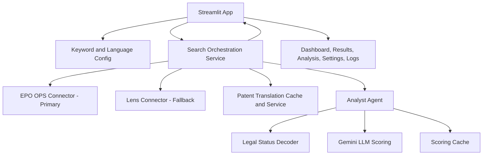

# Project Aether


Project Aether is a Streamlit-based patent intelligence workbench focused on high-signal triage for anomalous-energy research themes (hydrogen/plasma/LENR-adjacent domains).

It performs multilingual keyword search, provider-aware patent retrieval (EPO primary with Lens fallback), legal-status forensics (INPADOC), and LLM-assisted relevance scoring.

## What It Does

- Runs searches across one or more languages from a sidebar-controlled keyword set.
- Uses EPO OPS as the primary provider and Lens as fallback if EPO fails.
- Normalizes provider records into a shared identifier contract (`record_id`, `epo_id`, `lens_id`).
- Translates non-English results to English for downstream analysis when Gemini is configured.
- Scores title + abstract with Gemini using configurable keyword-aware prompts.
- Caches keyword translations, search results, patent translations, and LLM scoring outputs.
- Renders dashboard metrics, score-ranked result views, deep-dive patent analysis, diagnostics, and live logs.

## Current Runtime Architecture



## Tech Stack

- Python 3.12+
- Streamlit UI
- Gemini API (`google-genai`) for scoring and translation
- EPO OPS + Lens provider connectors
- Pydantic settings via `.env`
- Local JSON caches in `data/`
- `uv` for dependency and environment management

## Quick Start

### 1) Install dependencies

```bash
uv sync
```

### 2) Configure environment variables

```bash
cp .env.example .env
```

On PowerShell (Windows):

```powershell
Copy-Item .env.example .env
```

Then edit `.env` and set at minimum:

- `EPO_CONSUMER_KEY`
- `EPO_CONSUMER_SECRET`
- `GEMINI_API_KEY`

Optional fallback / extras:

- `LENS_ORG_API_TOKEN`
- `OPENAI_API_KEY`
- `SERPAPI_KEY`

### 3) Run the app

```bash
uv run streamlit run src/project_aether/app.py
```

## Configuration Notes

- `PATENT_PROVIDER` exists in config, but runtime search currently enforces EPO-first routing with Lens fallback.
- If EPO credentials are missing and Lens is configured, the app continues using Lens fallback.
- If both providers are unavailable, searches are aborted with an error.

## UI Workflow

1. In the sidebar, define keyword include/exclude terms (save/update reusable keyword sets).
2. Select one or more query languages.
3. Start search.
4. Monitor live dashboard progress and provider diagnostics.
5. Review scored results and inspect records in Detailed Analysis.
6. Use Logs tab for live runtime troubleshooting.

## Caching

Project Aether persists local caches under `data/`:

- `keyword_cache.json`: keyword sets, history, and translated keyword terms.
- `search_cache.json`: provider search responses keyed by full query parameters.
- `translation_cache.json`: abstract/text translations across languages.
- `scoring_cache.json`: LLM score/tag/feature outputs keyed by prompt+model+text.

Search cache entries are automatically cleaned when expired.

## Repository Structure

```text
project-aether/
├── .env.example
├── data/
│   ├── keyword_cache.json
│   ├── scoring_cache.json
│   ├── search_cache.json
│   ├── translation_cache.json
│   └── vectors/
├── docs/
│   ├── implementation_plan.md
│   ├── provider_migration_notes.md
│   └── ...
├── src/project_aether/
│   ├── app.py
│   ├── agents/
│   │   └── analyst.py
│   ├── core/
│   │   ├── config.py
│   │   ├── keyword_translation.py
│   │   ├── llm_scoring.py
│   │   ├── scoring_cache.py
│   │   ├── search_cache.py
│   │   └── translation_service.py
│   ├── services/
│   │   └── search.py
│   ├── tools/
│   │   ├── epo_api.py
│   │   ├── lens_api.py
│   │   └── inpadoc.py
│   ├── ui/
│   │   ├── dashboard.py
│   │   ├── results.py
│   │   ├── analysis.py
│   │   ├── logs.py
│   │   └── sidebar.py
│   └── utils/
│       └── artifacts.py
├── pyproject.toml
├── requirements.txt
└── README.md
```

## Troubleshooting

- **No search results:** verify keyword include terms are non-empty and at least one language is selected.
- **Provider errors:** check `EPO_CONSUMER_KEY` / `EPO_CONSUMER_SECRET`; optionally configure `LENS_ORG_API_TOKEN` for fallback.
- **No scoring/translation:** verify `GEMINI_API_KEY` and check the Logs tab for quota or auth failures.
- **Stale behavior:** inspect cache files in `data/` and clear selectively if needed.

## License

Licensed under GNU AGPLv3. See `LICENSE`.
