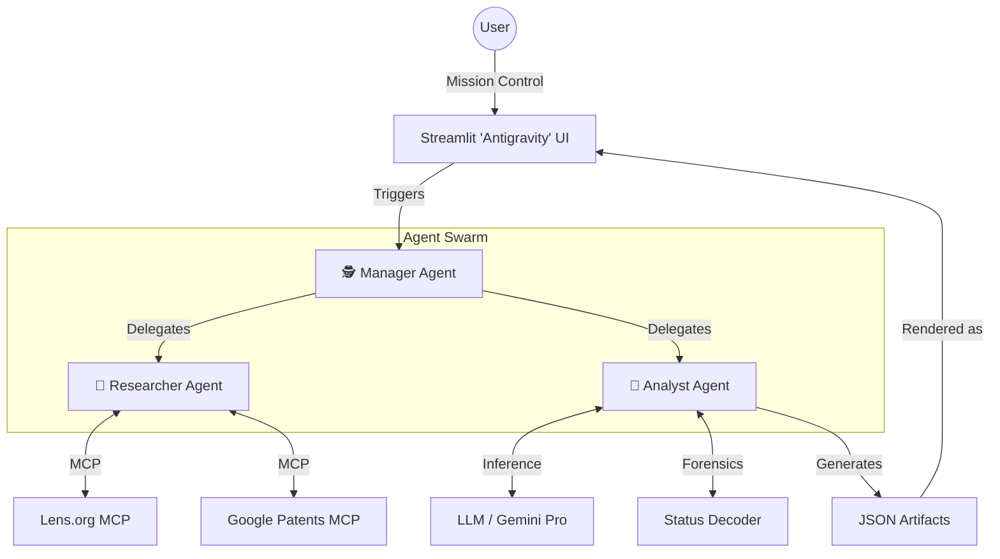

# Project Aether: Agentic Patent Intelligence Framework


**Project Aether** is a bespoke, agentic surveillance tool designed to monitor, analyze, and interpret patent activity within the specific domain of "sparks in hydrogen"—a proxy for high-voltage plasma physics, anomalous heat generation, and Low Energy Nuclear Reactions (LENR).

Unlike traditional search tools, Aether focuses on the **"Negative Space" of Innovation**: rejected patents, withdrawn applications, and discontinued prosecution. It operates on the "Antigravity" paradigm, orchestrating autonomous agents to perform deep forensic analysis on "dead" intellectual property in Russia and strategic European corridors.

## 🔭 The Strategic Mandate

In the realm of frontier physics, the most valuable intelligence often resides not in granted patents (sanitized for commerce) but in rejected applications (raw technical disclosures). Aether monitors:
* **Geographies:** Russian Federation (primary), Poland, Romania, Czechia, Netherlands, Spain, Italy, Sweden, Norway, Finland.
* **Targets:** Substantive rejections (e.g., Rospatent Art. 1352), anomalous heat claims, and plasma vortex technologies.
* **Logic:** Filters out "false positives" (automotive spark plugs) to find "potential positives" (anomalous plasma discharge).

## 🏗 Architecture: The "Antigravity" Paradigm

Aether moves beyond linear scripting to a **Manager-Worker Agent Topology**. The system treats the research process as a mission, not a query.



### Key Components

1. **Manager Agent:** Orchestrates the weekly mission, manages state, and handles error recovery.
2. **Researcher Agent:** Interfaces with external APIs (Lens.org) via **Model Context Protocol (MCP)**, handling rate limits and query translation.
3. **Analyst Agent:** Performs forensic analysis on INPADOC codes (distinguishing "administrative lapse" from "scientific rejection") and semantic scoring of abstracts.
4. **Artifacts:** Structured, interactive state objects rendered in the UI, allowing human-in-the-loop verification.

## 🛠 Tech Stack

* **Runtime:** Python 3.12+
* **Package Manager:** `uv` (for instant environment resolution)
* **UI/Frontend:** Streamlit (Agentic Workspace)
* **LLM Integration:** LangChain / Google Generative AI SDK
* **Data Layer:** SQLite (Local Cache) & LanceDB (Vector Embeddings)
* **Protocol:** Model Context Protocol (MCP) for tool abstraction

## ⚡ Quick Start

This project uses `uv` for dependency management.

### Prerequisites

* Python 3.12+
* Lens.org API Token
* Google Gemini / OpenAI API Key

### Installation

1. **Clone the repository:**
```bash
git clone [https://github.com/YourUsername/project-aether.git](https://github.com/YourUsername/project-aether.git)
cd project-aether

```


2. **Initialize environment with uv:**
```bash
uv sync

```


3. **Configure Secrets:**
Copy the example secrets file and add your API keys.
```bash
cp .env.example .env
# Edit .env with your LENS_API_TOKEN and LLM_API_KEY

```


4. **Run the Mission Control:**
```bash
uv run streamlit run src/app.py

```


## 🧩 Folder Structure

```text
project-aether/
├── .env                   # Environment variables (API keys) - DO NOT COMMIT
├── .env.example           # Template for environment variables
├── .gitignore             # Git ignore patterns
├── LICENSE                # AGPLv3 License
├── pyproject.toml         # uv dependencies and project metadata
├── README.md              # Project documentation
├── uv.lock                # Lock file for reproducible builds
├── data/                  # Local data storage (SQLite, vectors)
├── docs/
│   └── implementation_plan.md  # Strategic implementation plan
└── src/project_aether/
    ├── __init__.py
    ├── app.py             # Streamlit Entry Point (Mission Control)
    ├── agents/            # Agent Definitions
    │   ├── __init__.py
    │   ├── manager.py     # Mission Orchestration
    │   ├── researcher.py  # API Interaction (Lens.org)
    │   └── analyst.py     # Semantic Analysis & Forensic Scoring
    ├── core/              # Core Infrastructure
    │   ├── __init__.py
    │   ├── config.py      # Configuration management
    │   └── mcp_client.py  # Model Context Protocol Client
    ├── tools/             # External API Wrappers
    │   ├── __init__.py
    │   ├── lens_api.py    # Lens.org API Connector
    │   └── inpadoc.py     # Legal Status Decoder (INPADOC codes)
    └── utils/             # Utilities
        ├── __init__.py
        └── artifacts.py   # Artifact generation logic

```

## 🕵️‍♂️ Usage: The Weekly Workflow

1. **Monday Morning Run:** The Manager Agent wakes up and queries the last 7 days of "death" data (Discontinued/Withdrawn patents) in target jurisdictions.
2. **Forensic Filter:** The Analyst Agent decodes legal status. Code `FC9A` (Russia) flags a "Red Alert" (Substantive Rejection).
3. **Semantic Scoring:** Abstracts are embedded and scored against the "Anomalous Heat" vector. High scores generate a **Deep Dive Artifact**.
4. **Human Review:** You log into the Streamlit UI, view the "Rejection Matrix," and mark findings as *Relevant* or *Noise* to retrain the vector search.

## 📄 License

This project is licensed under the **GNU AGPLv3** - see the [LICENSE](https://www.google.com/search?q=LICENSE) file for details.

---

*Built with skepticism and curiosity.*
